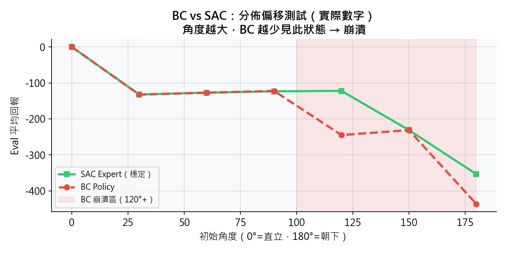
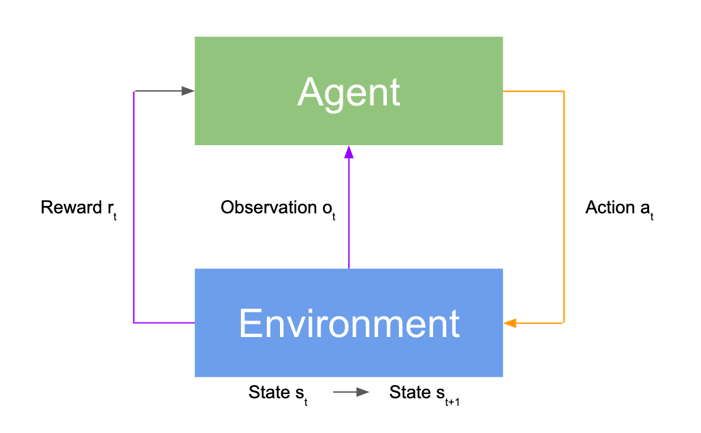
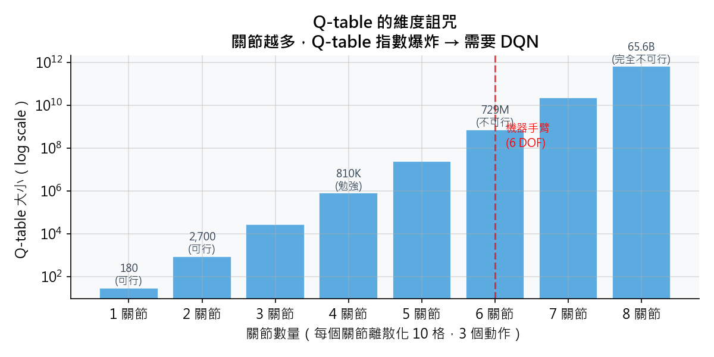
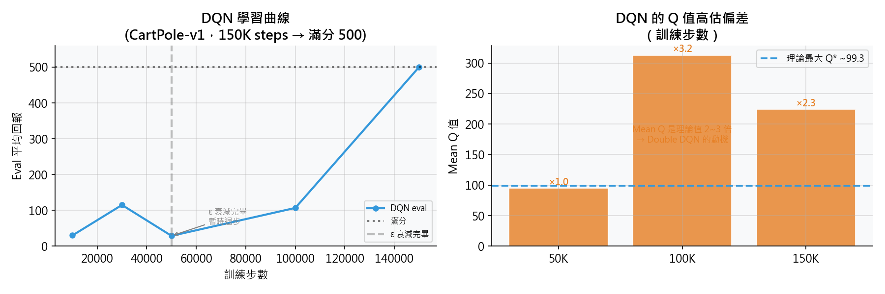
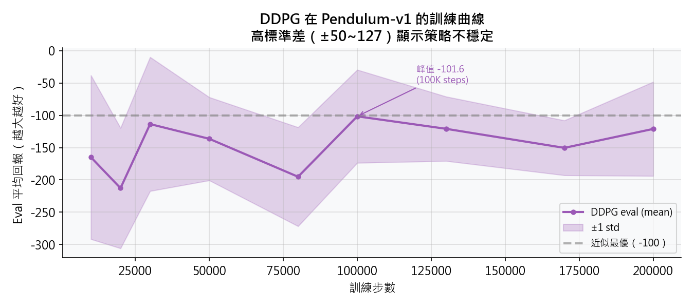
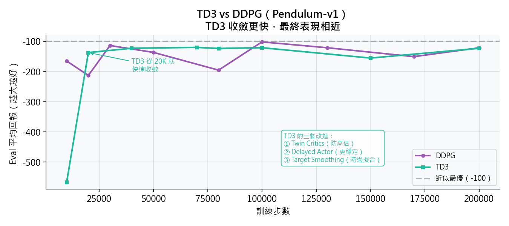
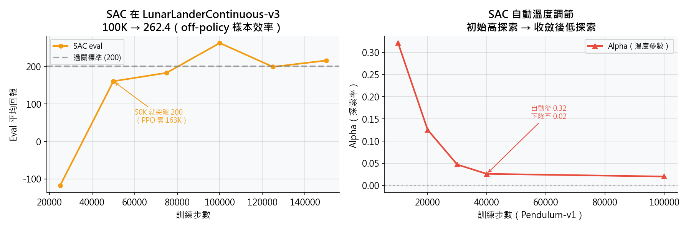
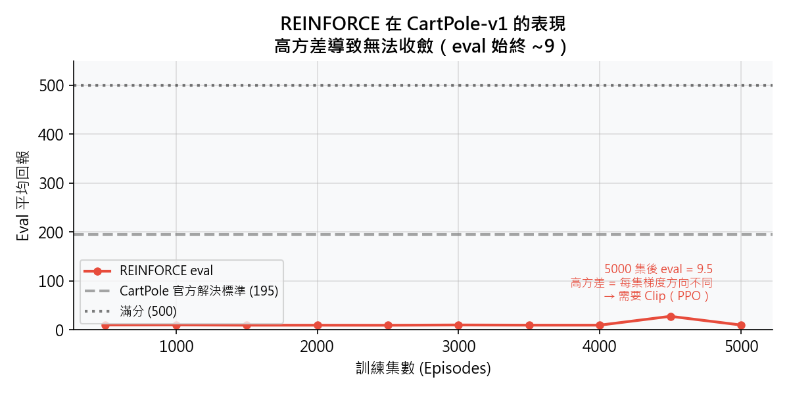
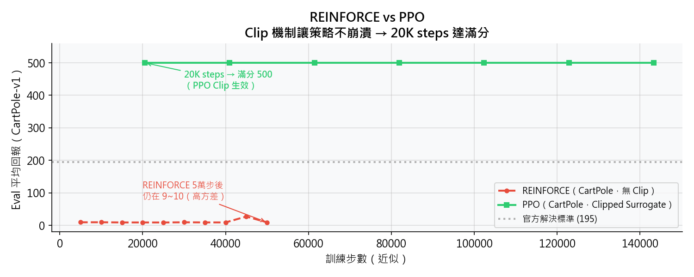

<!-- _class: title -->

# 機器人強化學習實作課

## 從模仿學習到連續動作控制

**7 種演算法**

BC → Q-Learning → DQN → DDPG → TD3 → SAC → PPO

<!--
- 歡迎大家，今天這堂課針對已有模仿學習經驗、正踏入具身機器人的你們
- 目標：不是單獨介紹 7 個演算法，而是帶你走一條完整的演進路線
- 每個演算法都在解答前一個演算法留下的問題——這是今天最重要的概念
- 預計兩小時，中間可以隨時提問
-->

---

## 課程敘事主線

> 人類示範 → 模仿失敗 → 需要 RL → 離散不夠 → 連續動作 → 多關節穩定 → 部署求穩  
> **BC** &emsp;&emsp;&emsp;&emsp; **分佈偏移** &emsp;&emsp; **DQN** &emsp;&emsp;&emsp; **CartPole** &emsp; **DDPG** &emsp;&emsp; **TD3 / SAC** &emsp; **PPO**

每個方法都在**回答前一個方法留下的問題**，形成一條完整因果鏈。

| 幕 | 主題 | 方法 |
|---|---|---|
| 第一幕 | 為什麼需要 RL？ | BC / Q-Learning / DQN |
| 第二幕 | 連續動作控制 | DDPG / TD3 / SAC |
| 第三幕 | 穩定訓練與部署 | PPO |

<!--
- 這張圖是今天的地圖，建議記住這條線
- 強調：不是孤立學，是一條因果鏈
- 三幕結構幫助大家掌握節奏——第一幕打基礎，第二幕進核心，第三幕收尾
- 課程結束時我們會再回到這張圖，你會發現每個方法的位置都非常清楚
-->

---

<!-- _class: act -->

# 第一幕

## 為什麼需要強化學習？

- 方法 1：Behavioral Cloning — 模仿看起來很直觀...
- 方法 2：Q-Learning — RL 的基礎語言
- 方法 3：DQN — 神經網路解決無限狀態

<!--
- 過渡頁，口頭問聽眾：「你們都做過 BC，覺得 BC 夠用嗎？」
- 讓大家思考一下，再進入下一頁
- 預告：BC 有一個很致命的問題，等一下揭曉
-->

---

# 方法 1｜Behavioral Cloning

## 最直觀的想法：讓機器人看人怎麼做，照著學

- 收集人類（或現有 policy）的示範軌跡
- 直接做**監督學習**：讓 policy 模仿專家動作

**訓練**：計算 policy 輸出與專家動作之間的 MSE Loss，做梯度下降

**推論**：直接讓 `policy(state)` 輸出動作，無需與環境互動

**優點**：簡單、不需要設計獎勵函式、不需要探索

**問題是什麼？**

<!--
- 這是大家熟悉的起點，快速帶過
- 強調優點：不需要設計獎勵函式，這在真實機器人中非常難
- 訓練 loss 很低、模仿看起來很好 ≠ 真實部署成功
- 賣個關子：「那問題在哪裡？」→ 翻下一頁
- 最後以「問題是什麼？」收尾，停頓讓聽眾思考，再見下一張揭曉 Distribution Shift
-->

---

## 方法 1 公式｜監督學習損失

$$L(\theta) = \frac{1}{N}\sum_{i=1}^{N}\lVert\pi_\theta(s_i) - a_i^{*}\rVert^2$$

| 符號 | 意義 | 範例 |
|------|------|------|
| $s_i$ | 狀態 | 擺錘角度與速度 |
| $a_i^{*}$ | **專家示範動作** | 人類施加的扭矩 |
| $\pi_\theta(s)$ | policy 輸出（我們要學的） | 預測動作值 |
| $\theta$ | 神經網路參數 | 所有可學習的權重 |

**本質**：和影像分類 MSE Loss 完全相同，純**監督學習**

> ⚠️ 公式中沒有 $r$（獎勵）——只學「專家見過的狀態」，這是 BC 的先天限制

<!--
- 聽眾最熟悉的公式，快速帶過即可
- 強調：沒有 r，這和後面所有 RL 方法的根本差異
- 影像分類類比：輸入圖片→標籤 vs 輸入狀態→動作，本質相同
-->

---

## Distribution Shift（分佈偏移）

**訓練時**：只看到專家軌跡附近的狀態（擺錘接近直立）

**測試時**：稍微偏離 → policy 不知道怎麼辦 → 錯誤累積 → 崩潰

| 初始角度 | SAC Expert | BC Policy |
|:---:|:---:|:---:|
| 0° – 90° | -123 | -123 ✅ |
| **120°** | **-122** | **-245 ❌** |
| **180°** | **-354** | **-437 ❌** |

> BC 不是沒用，**在見過的狀態附近**它模仿得很好
> 問題是：真實機器人碰到略微不同的初始狀態 → 累積誤差 → 崩潰

<!--
- 關鍵頁！先問：「為什麼 120度時 BC 就崩了？」讓聽眾思考
- 答案：訓練資料裡幾乎沒有 120 度的示範，BC 不知道怎麼處理
- 指著右圖：0-90度兩條線重疊，120度起 BC 開始偏離
- Compounding Error：第一步差一點 → 第二步更差 → 最後完全走偏
- 可點動態播放按鈕展示曲線逐步分叉
- 轉場：「所以我們需要一個能從錯誤中學習的方法」
-->

---

## 為什麼需要 RL？

**BC 的根本問題**：

> 訓練時只見好的狀態
> → 測試時若偏離 → 不知所措
> → 錯誤累積（Compounding Error）
> → **策略崩潰**

**我們需要讓 agent：**

1. 自己**探索**各種狀態（包括糟糕的狀態）
2. 從**錯誤中修正**，不只複製專家

→ **這就是強化學習（Reinforcement Learning）**

<!--
- BC 的問題不是技術問題，是根本的資料問題：示範只覆蓋了一小部分狀態
- 類比：只學過在平路走路的機器人，碰到臺階就倒了
- RL 的核心價值：主動探索 + 從獎懲中自我修正
- 大家已有 env→reward→action 的概念，這裡是正式引入為什麼需要它
-->

---

# 方法 2｜Q-Learning

## RL 的基礎語言：給機器人一個獎懲訊號，讓它自己學

**三個核心概念**

**① Q(s, a)**：在狀態 s 採取動作 a 的**長期期望回報**

**② Bellman Equation**（TD 更新）：

$$Q(s,a) \leftarrow Q(s,a) + \alpha\bigl[\underbrace{r + \gamma\max_{a'}Q(s',a')}_{\text{TD 目標}} - \underbrace{Q(s,a)}_{\text{現在估計}}\bigr]$$

**③ ε-greedy 探索**：
- 以 ε 機率隨機探索（避免陷入區域性最優）
- 以 1−ε 機率選最大 Q 值的動作（利用已有知識）

<!--
- Q 值的直覺：「從這個狀態做這個動作，未來總共能拿多少分」
- Bellman Equation 不需要推導，只解釋方向：TD 誤差告訴你現在的估計差多少，往那個方向更新
- ε-greedy 類比：小孩子探索玩具時，偶爾亂試，大多時候選最好的
- Q-Learning 在小型環境（FrozenLake）很好用，但有致命弱點→下一頁
-->

---

## 方法 2 公式｜Q-Learning 更新規則

$$Q(s,a) \leftarrow Q(s,a) + \alpha\bigl[\underbrace{r + \gamma\max_{a'}Q(s',a')}_{\text{TD 目標}} - \underbrace{Q(s,a)}_{\text{現在估計}}\bigr]$$

| 符號 | 意義 | 說明 |
|------|------|------|
| $\alpha$ | 學習率 | 每次更新走多大步 |
| $r$ | 即時獎勵 | 環境給的訊號 |
| $\gamma$ | 折扣因子（0～1）| 未來獎勵的重視程度 |
| $\max_{a'} Q(s',a')$ | 下一步最佳估計 | Bootstrap——用自己估自己 |

**BC → Q-Learning：根本差異**

| | BC | Q-Learning |
|---|---|---|
| 學習訊號 | 專家示範動作 | **TD 誤差**（自己探索）|
| 需要示範資料 | ✅ | ❌ |
| 考慮未來回報 | ❌ | ✅（$\gamma$）|

> 公式括號內 = **TD 誤差**：「目標值 − 現有估計」，往差距的方向修正

<!--
- Bootstrap 是 RL 的核心機制：用不完美的估計來改善估計，像滾雪球
- γ 的直覺：γ=0 只看眼前獎勵；γ=0.99 很在乎長遠回報
- 這個公式是後面所有 RL 方法的根基，DQN/DDPG/SAC 都是它的變體
-->

---

## Q-table 的致命問題

**FrozenLake（4×4 格子）**：
- 16 個格子 × 4 個動作 = **64 個 Q 值**
- Q-table 完全可行 ✅

**CartPole（4 個連續變數）**：
- 每個維度離散化 10 格 → 10⁴ × 2 = **20,000 Q 值**
- 勉強可行...

**機器手臂（6 個關節）**：
- 10⁶ × 3⁶ = **729,000,000 Q 值**
- 記憶體放不下 ❌
- 學習時間無限長 ❌

> **結論**：Q-table 解決不了真實機器人的連續狀態問題

<!--
- 互動時機！先問聽眾：「6 個關節的機器手臂，Q-table 需要多大？」讓大家猜
- 答案：7億個值，一臺電腦根本放不下
- 右圖：指著 6 關節那根柱子，紅虛線就是機器手臂的位置
- 可點動態播放，看柱子一根一根長高，視覺衝擊感很強
- 轉場：「所以我們需要一個不用查表、能泛化的方法——DQN」
-->

---

# 方法 3｜DQN（Deep Q-Network）

## 用神經網路取代 Q-table，解決無限狀態問題

**DQN 的兩個關鍵設計**

**① Experience Replay（經驗回放）**
- 不直接學當前轉移，而是從 Replay Buffer 中**隨機取樣**一批過去的經驗
- → 打破時序相關性，避免網路過擬合最近的狀態，穩定訓練

**② Target Network（目標網路）**
- TD 目標 `y = r + γ · target_net(s').max()` 由**慢速更新**的獨立網路計算
- → 固定學習目標，防止主網路「追著自己跑」導致震盪

<!--
- 核心突破：用神經網路當函式逼近器，輸入 state 直接輸出 Q 值，不需要查表
- Experience Replay：為什麼不能直接學？連續動作高度相關，網路容易過擬合當前狀態
- Target Network 的類比：「用一週前的自己來評分，而不是用當前不穩定的自己」
- 這兩個設計加起來讓 DQN 在 Atari 遊戲上第一次超越人類——2013年的歷史時刻
-->

---

## 方法 3 公式｜DQN 損失函數

$$L(\theta)=\mathbb{E}\!\left[\!\left(r+\gamma\max_{a'}Q_{\bar\theta}(s',a')-Q_\theta(s,a)\right)^{\!2}\right]$$

| 符號 | 意義 | 對應設計 |
|------|------|----------|
| $Q_\theta$ | **主網路**（持續更新）| 要訓練的神經網路 |
| $Q_{\bar\theta}$ | **Target 網路**（慢更新）| 固定學習目標，穩定訓練 |
| $\mathbb{E}[\cdots]$ | **期望值** | Replay Buffer 隨機取樣 |

**Q-Learning → DQN：多了什麼？**

| | Q-Learning | DQN |
|---|---|---|
| Q 函數表示 | Q-table（查表）| ✅ **神經網路**（泛化無限狀態）|
| 訓練穩定性 | 無需考慮 | ✅ Experience Replay |
| 學習目標 | 即時更新 | ✅ Target Network 慢更新 |

> 公式形式與 Q-Learning 幾乎相同——差別只有**神經網路**替換表格、加兩個穩定設計

<!--
- 為什麼加 E？連續動作的時序相關性讓網路容易過擬合最近的狀態，Replay 打散它
- Target Net 類比：「用一週前的自己來評分，不被當下不穩定的自己帶偏」
- DQN 的兩個設計都是為了解決同一問題：神經網路訓練的不穩定性
-->

---

## DQN 訓練結果

**環境**：CartPole-v1

**結果**：
- **150K 步**：eval = **500**（滿分）🎉
- Q 值高估：mean Q 高達 **312**（理論值 ~50）
- 高估來自 `max` 運算元的系統性偏差

**DQN 的限制**：
- 輸出是**離散動作**（左 / 右）
- 無法直接控制馬達的**連續角度**
- 機器手臂需要扭矩值，不是「往左或往右」

<!--
- 150K steps 就達滿分，Q-Learning 的表格法做不到
- Q 值高估是 DQN 的已知弱點（DDQN 解決，但今天不展開）
- 點動態播放：可以看到訓練曲線先下降（ε 衰減期）再上升到滿分
- 關鍵轉折：DQN 解決了狀態空間問題，但輸出還是離散的
- 問聽眾：「如果要控制關節扭矩 -1.5 N·m，DQN 怎麼辦？」→ 做不到
- 轉場：「進入第二幕，連續動作的世界」
-->

---

<!-- _class: act -->

# 第二幕

## 連續動作——進入真實機器人領域

- 方法 4：DDPG — Actor-Critic，直接輸出連續扭矩
- 方法 5：TD3 — 修掉 DDPG 的三個已知缺陷
- 方法 6：SAC — 自動平衡探索與利用

<!--
- 過渡：「剛才的 DQN 只能說左或右，現在我們要讓機器人控制精確的扭矩」
- 第二幕是今天最硬核的部分，也是和具身機器人最直接相關的
- 三個演算法是遞進關係：DDPG → TD3 → SAC，每個修補前一個的缺陷
-->

---

# 方法 4｜DDPG（Deep Deterministic Policy Gradient）

## 如何控制連續的馬達扭矩？

**Actor-Critic 架構**

- **Actor 網路**：輸入 state，輸出**連續動作值**（扭矩 ∈ [−2, 2]）
- **Critic 網路**：輸入（state, action），輸出 **Q 值**（這個動作長期有多好？）

**與機器手臂的對應**：
- Actor = 關節角度控制器（「現在這個姿態，施加多少扭矩？」）
- Critic = 評估這個姿態的長期價值

**訓練邏輯**：Actor 輸出動作，Critic 評分；Actor 的目標是讓 Critic 的評分越高越好

<!--
- Actor-Critic 是第二幕所有演算法的共同骨架，這頁要講清楚
- 類比：Actor 是球員，Critic 是教練——教練評分，球員照著改進
- 連續動作：輸出是 tanh 啟用的向量，可以是任意維度（六軸機器臂就是6維）
- 與機器手臂的對應非常直接，可以讓聽眾想像 FetchReach 場景
- Deterministic（確定性）：每次輸入相同狀態，輸出固定動作（不像後面的 SAC 是隨機的）
-->

---

## 方法 4 公式｜Actor-Critic 梯度

$$a = \mu_\phi(s) \qquad\text{（Actor：確定性連續動作）}$$

$$\nabla_\phi J \approx \mathbb{E}\!\left[\nabla_a Q_\theta(s,a)\big|_{a=\mu_\phi(s)}\cdot\nabla_\phi\mu_\phi(s)\right]$$

$$L(\theta)=\mathbb{E}\!\left[\!\left(r+\gamma Q_{\theta'}(s',\mu_{\phi'}(s'))-Q_\theta(s,a)\right)^{\!2}\right]$$

| 符號 | 意義 |
|------|------|
| $\mu_\phi(s)$ | Actor：輸出**連續動作**（扭矩 ∈ [-2, 2]）|
| $Q_\theta(s,a)$ | Critic：評估（狀態, 動作）對的長期回報 |
| $\phi',\theta'$ | Target Actor / Critic（Soft 慢更新）|

**DQN → DDPG：多了什麼？**

| | DQN | DDPG |
|---|---|---|
| 動作類型 | 離散（argmax 查表）| ✅ **連續**（$\mu_\phi$ 直接輸出）|
| 網路架構 | 單一 Q-net | ✅ **Actor + Critic 分開** |
| 適用任務 | CartPole（左/右）| **Pendulum / 機器手臂** |

<!--
- Critic 梯度反向傳給 Actor：「讓 Q 更高的動作方向，就是 Actor 要更新的方向」
- chain rule：∇_φ J = ∇_a Q × ∇_φ μ，兩層梯度連乘
- 連續動作的意義：不是「往左或往右」，而是「施加 1.37 N·m 的扭矩」
-->

---

## DDPG 訓練結果

**環境**：Pendulum-v1（單關節扭矩控制）

**結果**：
- 最佳 eval = **-101.6**（接近最優 -100）🎉
- 但訓練曲線震盪劇烈
- 高標準差：策略不穩定

**DDPG 的三個已知問題**：
1. Q 值**高估**（max 運算元偏差）
2. Actor **更新太快**，Critic 還沒學好
3. 過擬合特定動作，**探索不足**

<!--
- 好訊息：DDPG 確實能控制連續動作，達到接近最優的 -101.6
- 壞訊息：看右圖的陰影帶，標準差極大——意味著有時候很好，有時候很差
- 部署到真實機器人時這種不穩定是不可接受的
- 三個問題是 DDPG 論文自己承認的，TD3 論文直接對應這三個問題提出解法
- 可點動態播放，看陰影帶有多寬（±126 這樣的方差代表策略非常不穩定）
-->

---

# 方法 5｜TD3（Twin Delayed Deep Deterministic）

## DDPG 的三個問題，TD3 一次修掉

| 問題 | TD3 的解法 | 程式碼改動 |
|---|---|---|
| Q 值高估 | **Twin Critics**：取兩個 Critic 的最小值 | +1 個 Critic 網路 |
| Actor 更新太快 | **Delayed Actor Update**：每 2 步才更新 Actor | `if step % 2 == 0` |
| 探索不足 | **Target Policy Smoothing**：目標動作加入雜訊 | `a' += clip(noise, -c, c)` |

**完整 TD 目標計算步驟**：

1. 對目標動作加入截斷雜訊 `clip(ε, −c, c)`，平滑探索避免過擬合
2. 用兩個 Target Critic 分別估計下一步 Q 值：`q1` 和 `q2`
3. 取兩個估計中的**較小值** `min(q1, q2)` 作為 TD 目標，保守估計避免高估

<!--
- TD3 的設計非常工程化：找到問題，針對性修補
- Twin Critics 直覺：兩個老師打分取低分——保守估計，避免過度樂觀
- Delayed Actor：先讓 Critic 學穩了，再更新 Actor。比例是 2:1
- Target Smoothing：目標動作加噪聲，讓 Critic 不要對某個特定動作過擬合
- 程式碼改動極小：只加一個網路、加一個 if 條件、加一行噪聲
- 強調：這三個改動合起來才發揮效果，缺一不可
-->

---

## 方法 5 公式｜TD3 的三個修補

$$\tilde{a} = \mu_{\phi'}(s') + \text{clip}(\varepsilon,{-}c,\,c),\quad \varepsilon\sim\mathcal{N}(0,\sigma)$$

$$y = r + \gamma\,\min\!\bigl(Q_{\theta_1'}(s',\tilde{a}),\; Q_{\theta_2'}(s',\tilde{a})\bigr)$$

**DDPG → TD3：三行改動，解三個問題**

| DDPG 問題 | TD3 修補 | 公式對應 |
|-----------|----------|----------|
| Q 值高估 | Twin Critics 取最小值 | $\min(Q_1', Q_2')$ |
| 探索不足 | 目標動作加截斷雜訊 | $+\text{clip}(\varepsilon,-c,c)$ |
| Actor 更新太快 | 每 2 步才更新 Actor | 程式碼 `if step%2==0` |

> ✅ 三個改動合起來才發揮效果，缺一不可；代碼改動極小，效果顯著

<!--
- min(Q1, Q2)：類比兩位老師打分取低分——保守估計，避免系統性高估
- clip noise：讓 Critic 不要對某個特定動作值過擬合，增強泛化
- Delayed Actor：先讓 Critic 學穩了，Actor 根據穩定的 Critic 再改進
- TD3 = DDPG + 3 行改動，說明好的工程改進不需要完全重設計
-->

---

## TD3 vs DDPG 對比

**環境**：Pendulum-v1

| 演算法 | 最佳 Eval | 收斂步數 |
|---|---|---|
| DDPG | -101.6 | 100K |
| **TD3** | **-119.8** | **70K** |

- TD3 峰值略低，但**收斂更快、更穩定**
- 標準差更小：部署時更可靠

**TD3 的限制**：
- 探索仍依賴**人工加雜訊**（固定探索強度）
- 多關節任務容易陷入**區域性最優**
- 如何讓機器人自動決定探索多少？

<!--
- 數字上 TD3 峰值(-119.8)反而比 DDPG(-101.6) 差一些——因為 Pendulum 太簡單了
- 真正的差異在穩定性：TD3 的方差明顯更小，訓練曲線更平滑
- 可點動態播放：兩條曲線同時繪製，TD3（綠）比 DDPG（紫）更快收斂且更穩
- TD3 的剩餘問題：探索靠固定噪聲，太少容易區域性最優，太多又破壞已學的好策略
- 問聽眾：「能不能讓機器人自己決定要探索多少？」→ 引出 SAC
-->

---

# 方法 6｜SAC（Soft Actor-Critic）

## 引入資訊熵，讓機器人自動平衡探索與利用

**最大熵強化學習**：

$$\text{一般 RL：}\max_\pi\;\mathbb{E}\!\left[\sum_t r_t\right]$$

$$\textbf{SAC：}\max_\pi\;\mathbb{E}\!\left[\sum_t\bigl(r_t + \alpha\cdot\underbrace{\mathcal{H}(\pi(\cdot|s_t))}_{\uparrow\,\text{鼓勵高 Entropy（多樣性）}}\bigr)\right]$$

**為什麼 Entropy 對機器人重要？**

- 高 Entropy = 保持探索 = 不陷入區域性最優
- 不只學「一種解法」，而是「任何合理姿態都行」
- 部署到真實硬體時更穩健

**關鍵：α 自動調整**（不需手動調探索率）

<!--
- Entropy 的直覺：策略的「不確定性」或「多樣性」——高 Entropy 代表動作分佈更分散
- 類比：DDPG/TD3 像只會一招的高手，SAC 像武藝全面的高手
- 最大化 reward + entropy 的好處：即使找到一個好解，仍保持探索其他解
- α 自動調整是 SAC 最實用的特點：不需要手動調探索率，省去大量超引數調優時間
- SAC 輸出的是動作的機率分佈（Gaussian），而不是固定動作——這是和 DDPG/TD3 的本質差異
-->

---

## 方法 6 公式｜最大熵目標

$$\pi^* = \arg\max_\pi \mathbb{E}\!\left[\sum_t \bigl(r_t + \alpha\cdot\mathcal{H}(\pi(\cdot|s_t))\bigr)\right]$$

| 符號 | 意義 | 對應設計 |
|------|------|----------|
| $\mathcal{H}(\pi)$ | 策略熵（多樣性）| 鼓勵動作分佈更分散 |
| $\alpha$ | 溫度參數（探索強度）| **自動調整**，不需手動設定 |
| $\pi(\cdot\|s)$ | **隨機** policy | 輸出高斯分佈，而非固定值 |

**TD3 → SAC：核心差異**

| | TD3 | SAC |
|---|---|---|
| Policy 類型 | 確定性 $\mu_\phi(s)$ | **隨機** $\pi_\phi(\cdot\|s)$ |
| 探索方式 | 手動加固定雜訊 | **Entropy 內建探索** |
| 溫度 $\alpha$ | 手動設定 | ✅ 自動最佳化 |
| 適合任務 | 簡單單軸 | **多軸 / 多解任務** |

> 最大化 $r + \alpha H$：即使找到好解，策略仍保持探索其他合理路徑

<!--
- H(π) 直覺：策略越「猶豫」代表越多樣，高熵 = 同一狀態有多種合理動作
- α 自動調整公式：min_α E[α(H_target - H(π))]——讓熵自動維持在目標值
- 確定性 vs 隨機的實際差異：DDPG/TD3 對同一狀態永遠輸出同一動作，SAC 保持靈活性
-->

---

## SAC 自動溫度調節

- 訓練初期：α 高（強迫探索）
- 策略收斂後：α 自動下降（停止過度探索）
- 完全自動，**無需手動調**

**SAC 在不同環境的表現**：

| 環境 | Eval | 步數 |
|---|---|---|
| Pendulum | -171.8 | 100K |
| **LunarLanderCont.** | **262.4** | **100K** |

> Pendulum 太簡單，SAC 的優勢在複雜多軸任務才顯現

<!--
- 左圖（LunarLander）：50K steps 就突破 200 分，PPO 需要 163K 才能做到
- 右圖（Alpha 下降）：訓練初期 0.32，收斂後自動降到 0.02，完全不需要人工幹預
- 資料對比：Pendulum 上 SAC(-171.8) 反而比 DDPG(-101.6) 差——這是正常的
- Pendulum 是個超簡單的單關節環境，SAC 的多樣性在這裡反而是負擔
- SAC 的競爭力在 LunarLander、FetchReach 這類需要泛化的多軸任務
- 可點動態播放，特別看右圖的 Alpha 自動下降曲線
-->

---

## 三種連續控制演算法對比

**Pendulum-v1**（回報越靠近 0 越好）：

| 演算法 | 最佳 Eval | 步數 | 訓練穩定性 |
|---|---|---|---|
| **DDPG** | **-101.6** | 100K | 低（高方差）|
| TD3 | -119.8 | 70K | 中（更穩）|
| SAC | -171.8 | 100K | 高（但過度探索）|

**LunarLanderContinuous-v3**：

| 演算法 | eval ≥ 200 達成步數 |
|---|---|
| PPO | ~163K 步 |
| **SAC** | **~50K 步** ← 樣本效率碾壓 |

> **SAC 的競爭力不在極簡任務，而在多軸連續控制**

<!--
- 上表：Pendulum 太簡單，DDPG 反而贏——不代表 DDPG 更好
- 下表：LunarLander 才是真正的戰場，SAC 樣本效率是 PPO 的 3 倍
- 重點：選演算法要看任務複雜度，不能只看一個環境的數字
- 具身機器人的真實場景更接近 LunarLander（多軸、連續、需要泛化）→ SAC 是首選
-->

---

## 為什麼 SAC 是業界標準

**真實機器人部署的三個需求**：

| 需求 | SAC 的表現 |
|---|---|
| 樣本效率 | ✅ Off-policy，可重用舊資料 |
| 訓練穩定 | ✅ Entropy 正則化防止策略崩潰 |
| 超引數敏感度 | ✅ α 自動調整，減少調參負擔 |

**SAC 的限制**：
- 計算成本略高（兩個 Critic + 一個 Actor + Value Net）
- 在模擬環境快速迭代時，on-policy 的 PPO 更常用

<!--
- 真實機器人每次互動都有成本（磨損、電費、時間），Off-policy 能重用舊資料非常關鍵
- Berkeley、CMU 的機器人抓取實驗大多用 SAC 或其變體
- SAC 的限制：計算量比 PPO 大約 2-3 倍，模擬器便宜的話 PPO 更划算
- 引出第三幕：「在模擬器裡跑一千萬步都沒問題，這時候用 PPO 更好——為什麼？」→ 見下一張
-->

---

<!-- _class: act -->

# 第三幕

## 穩定訓練，走向實際部署

- 方法 7：PPO — 為什麼 OpenAI、DeepMind 的機器人論文幾乎都用 PPO？

<!--
- 過渡：SAC 適合真實硬體，那模擬器環境呢？
- PPO 是目前最廣泛使用的 RL 演算法，OpenAI Five、AlphaGo、ChatGPT 的 RLHF 都用它
- 第三幕比較短，重點是理解 PPO 為什麼這麼穩定
-->

---

# 方法 7｜PPO（Proximal Policy Optimization）

## 先看 REINFORCE 的問題

**REINFORCE**（最基本的 Policy Gradient）：

$$\mathcal{L}_{\text{REINFORCE}}(\theta) = -\log\pi_\theta(a_t|s_t)\cdot G_t \qquad\text{（直接對回報加權做梯度上升）}$$

**問題**：每次更新幅度**無限制**
- 一次更新走太遠 → 策略崩潰
- 崩潰後很難恢復

**實際結果**（我們跑的）：

<!--
- 先看我們實際跑的 REINFORCE 結果：5000 集後 eval 還在 9，完全沒學到
- 根本原因：梯度更新沒有上界，一步走太遠就崩了，很難回來
- 類比：想改善公司制度，但一次改太多，反而搞亂了，沒辦法漸進恢復
- 這個問題在連續動作環境更嚴重，因為動作空間更複雜
- 可以點動態播放，看 REINFORCE 一直在底部震盪
-->

---

## PPO 的核心創新：Clipped Objective

**PPO 的限制更新幅度**：

$$r(\theta) = \frac{\pi_\theta(a|s)}{\pi_{\theta_\text{old}}(a|s)} \qquad\text{（新舊策略的比值）}$$

$$\mathcal{L}^{\text{CLIP}}(\theta) = -\min\!\bigl(\underbrace{r(\theta)\cdot A}_{\text{原始目標}},\;\underbrace{\text{clip}(r(\theta),\,1{-}\varepsilon,\,1{+}\varepsilon)\cdot A}_{\text{裁剪版本}}\bigr)$$

> 「每次更新不能走太遠，新策略和舊策略的差距要在安全範圍內。」

**優點**：
- 單次更新有上界 → 策略不會崩潰
- 可以在同一批資料上多次更新（`n_epochs`）
- 實作簡單，穩定性極高

<!--
- Clip 的直覺：ratio > 1+ε 就截掉，不讓策略跳太遠
- 類比：「公司改革每次最多調整 20%，確保每一步都是可逆的」
- n_epochs 是 PPO 的另一大優點：同一批資料用 10 次，樣本效率比 REINFORCE 好很多
- ε 通常設 0.2，這是 PPO 論文推薦的預設值，很少需要調
- PPO 的實作非常簡單，相比 SAC 的多個網路，PPO 程式碼更少、更容易 debug
-->

---

## 方法 7 公式｜Clipped Objective

$$r_t(\theta) = \frac{\pi_\theta(a_t|s_t)}{\pi_{\theta_\text{old}}(a_t|s_t)}$$

$$L^{\text{CLIP}}(\theta) = \mathbb{E}_t\!\left[\min\!\left(r_t(\theta)\, A_t,\;\text{clip}(r_t(\theta),\,1{-}\varepsilon,\,1{+}\varepsilon)\, A_t\right)\right]$$

| 符號 | 意義 | 典型值 |
|------|------|--------|
| $r_t(\theta)$ | 新舊策略比值（= 1 代表沒變）| 訓練初期接近 1 |
| $\varepsilon$ | Clip 寬度 | **0.2**（PPO 預設）|
| $A_t$ | Advantage：這個動作比平均好多少 | $G_t - V(s_t)$ |

**REINFORCE → PPO：三項升級**

| | REINFORCE | PPO |
|---|---|---|
| 更新約束 | 無上限（容易崩潰）| ✅ Clip 限制每步最多 ±20% |
| 資料利用 | 每批只用一次 | ✅ 同批重複 `n_epochs` 次 |
| 回報估計 | $G_t$（高方差）| ✅ $A_t$（降低方差）|

> `min` 確保：好動作不會被過度獎勵，壞動作不會被過度懲罰——更新永遠保守

<!--
- r_t clip 在 [0.8, 1.2]：每次更新最多改變 20%，策略不會突然崩潰
- n_epochs：PPO 把同一批資料用 10 次，REINFORCE 只用 1 次——樣本效率差 10 倍
- A_t = G_t - V(s_t)：Advantage 扣掉基線，讓梯度訊號更乾淨，方差更小
-->

---

## REINFORCE vs PPO

**CartPole-v1**：

| 演算法 | 最終 Eval |
|---|---|
| REINFORCE | **9.5**（卡住）|
| **PPO** | **500**（滿分）|

**LunarLander-v3**：
- PPO eval ≈ **284**
- 穩定收斂，訓練曲線平滑

<!--
- 這是今天最戲劇性的對比：一條線趴在底部，另一條直接衝到滿分
- PPO 在 20K steps 就達到 500——REINFORCE 跑 50K 還在 9
- 點動態播放：可以清楚看到兩條線的分叉時刻就在 PPO 開始訓練的瞬間
- LunarLander 284 分，是相當好的表現（200分就算過關）
- Clip 的效果一目瞭然：限制步長讓訓練變得穩定可預測
-->

---

## SAC vs PPO 使用場景

| | SAC | PPO |
|---|---|---|
| 訓練方式 | Off-policy（重用舊資料）| On-policy（每次更新後丟棄）|
| 樣本效率 | ✅ 高 | 低 |
| 訓練穩定性 | 高 | ✅ 很高 |
| 計算需求 | 中 | 低 |
| **適用場景** | **真實機器人部署** | **模擬環境快速迭代** |

**實際選擇**：
- 模擬器便宜（可以跑百萬步）→ PPO
- 真實機器人資料貴（每步都要錢）→ SAC

<!--
- 這張表是今天最實用的總結之一，實際做研究時會一直查到
- On-policy vs Off-policy 的本質差異：PPO 每批資料只用一次，SAC 放進 Replay Buffer 重複用
- 業界常見做法：先用 PPO 在模擬器裡訓練，再用 SAC 做真實機器人的 Fine-tune
- OpenAI Dexterous Hand 就是這個策略——PPO 在模擬器訓練，部署時用 SAC 繼續調整
- 問聽眾：「你們的機器人專案比較貴的是模擬器時間還是真實硬體時間？」→ 幫他們選演算法
-->

---

<!-- _class: act -->

# 課程總結

## 7 種演算法的完整因果鏈

<!--
- 過渡頁，口頭說：「讓我們把今天走過的路再看一遍」
-->

---

## 完整因果鏈回顧

| 方法 | 核心問題 | 解法 | 環境 | 結果 |
|---|---|---|---|---|
| **BC** | 有示範就夠了嗎？ | 監督學習模仿 | Pendulum | -145（分佈內）|
| **Q-Learning** | RL 的基礎語言？ | Bellman + ε-greedy | FrozenLake | 收斂 ✅ |
| **DQN** | 無限狀態怎麼辦？ | 神經網路 + Replay + Target | CartPole | 500 ✅ |
| **DDPG** | 連續動作怎麼辦？ | Actor-Critic | Pendulum | -101.6 ✅ |
| **TD3** | DDPG 為何不穩？ | Twin Q + Delay + Noise | Pendulum | -119.8 ✅ |
| **SAC** | 如何自動探索？ | 最大熵 + 自動 α | Pendulum+LunarLander | -172 / 262 ✅ |
| **PPO** | 如何穩定更新？ | Clip + On-policy | CartPole+LunarLander | 500 / 284 ✅ |

<!--
- 帶著大家從上到下念一遍「核心問題」那一欄
- 每個問題都是前一個演算法的弱點：BC → Q-Learning → DQN → DDPG → TD3 → SAC → PPO
- 這張表也是論文 related work 的好架構，以後寫論文可以直接引用這個脈絡
- 強調：這不是 7 個孤立的演算法，是一個演進故事，每一步都有理由
-->

---

## 下一步：走向真實機器人

**課後延伸方向**：

| 主題 | 方法 | 解決的問題 |
|---|---|---|
| 稀疏獎勵 | **HER**（Hindsight Experience Replay）| 「幾乎從不成功」的任務 |
| 更好的模仿 | **GAIL** | BC + RL 的結合 |
| 減少真實資料需求 | **Model-Based RL**（Dreamer）| 用世界模型想像未來 |
| 模擬→真實 | **Sim-to-Real Transfer** | Domain Randomization |

**核心訊息**：

> 機器人 RL 的每一步進展，都是在解答前一個方法的限制。
> 這條因果鏈還在繼續——下一個突破就在你的研究中。

<!--
- HER：稀疏獎勵的救星，特別適合機器手臂抓取任務（幾乎永遠拿不到獎勵）
- GAIL：把 BC 和 RL 結合，解決 BC 的分佈偏移問題，同時保留模仿的樣本效率
- Dreamer/Model-Based：用更少的真實資料，因為可以在「想像」中訓練
- Sim-to-Real 是進入實際機器人的必修課：Domain Randomization 讓模擬訓練出來的策略能遷移到真實
- 結尾鼓勵：「今天的 7 種演算法是你的工具箱，下一個你要解決的問題是什麼？」
-->

---

<!-- _class: title -->

# 謝謝

## 問題討論

<!--
- 開放 Q&A
- 可以準備幾個引導問題：
  1. 你們的機器人任務用哪個演算法最合適？
  2. 有沒有遇到 BC 分佈偏移的實際案例？
  3. 對 SAC 的 Entropy 機制還有疑問嗎？
-->

---

<!-- _class: act -->

# 講師附錄

## 超參數位置 × 結果重點 × 常見問題

<!--
- 以下附錄頁不對聽眾展示，供課後或回答問題時快速翻閱
- 完整細節見 QUICK_REF.md（可用 Ctrl+F 搜尋）
-->

---

## 附錄 A｜第一幕超參數速查

| 演算法 | 檔案 | 關鍵行 | 最重要超參數 |
|--------|------|--------|-------------|
| **BC** | `00_Imitation/2004_BC/train.py` | 191–193 | `n_epochs=100` `batch_size=256` `lr=1e-3` |
| **Q-Learning** | `01_Tabular_Basics/1989_QLearning/train.py` | 369–372 | `alpha=0.1` `gamma=0.99` `epsilon_start=1.0` |
| **DQN** | `02_Value_Based_Deep/2013_DQN/train.py` | 20–39（CONFIG）| `lr=1e-3` `batch_size=64` `gamma=0.99` |

**結果重點**：
- BC：0°–90° 正常，**120°+ 崩潰**（分佈偏移）→ `eval(-123)` vs `eval(-245)`
- DQN：**150K 步達滿分 500**；Q 值高估（~312）是已知現象，非 bug

<!--
- BC 聽眾最常問：「為什麼 120 度崩掉？」→ 訓練資料幾乎沒有 120 度示範，Compounding Error
- DQN 聽眾常問：「Q 值高估要緊嗎？」→ 不影響 CartPole 效果，DDQN 解決但今天不展開
-->

---

## 附錄 B｜第二幕超參數速查

| 演算法 | 檔案 | 關鍵行 | 最重要超參數 |
|--------|------|--------|-------------|
| **DDPG** | `04_Actor_Critic_Continuous/2015_DDPG/train.py` | 82–85 | `lr_actor=1e-4` `lr_critic=1e-3` `tau=0.005` |
| **TD3** | `04_Actor_Critic_Continuous/2018_TD3/train.py` | 75–77 | `lr=3e-4` `buffer=200K` `batch=256` |
| **SAC** | `04_Actor_Critic_Continuous/2018_SAC/train.py` | 73–75 | `lr=3e-4` `tau=0.005` `alpha=自動` |

**Pendulum-v1 結果**（eval 越接近 0 越好，最優 ≈ −100）：

| | DDPG | TD3 | SAC |
|---|---|---|---|
| 最佳 Eval | **−101.6** | −119.8 | −171.8 |
| 收斂步數 | 100K | **70K** | 100K |
| 方差 | 高 ❌ | 中 ✅ | 低（過探索）|

<!--
- 常問：「TD3 為什麼比 DDPG 分數差卻說更好？」→ Pendulum 太簡單，DDPG 偶爾運氣好；看標準差才是重點
- 常問：「SAC alpha 能固定嗎？」→ 可以，但失去自動調整優勢
- lr_actor < lr_critic（DDPG）原因：Actor 更新快會讓 Critic 跟不上，縮小步長穩定訓練
-->

---

## 附錄 C｜第三幕超參數速查

**PPO** — `03_Policy_Gradient/2017_PPO/train.py`，行 96–101

| 超參數 | 值 | 作用 |
|--------|-----|------|
| `lr` | 3e-4 | 學習率 |
| `n_steps` | 2048 | 每次收集多少步再更新 |
| `clip_range` ε | **0.2** | 每次更新最多改變 ±20%（核心！）|
| `n_epochs` | ≈ 10 | 同一批資料重複訓練幾次 |

**結果對比**：

| 演算法 | CartPole | 步數 |
|--------|----------|------|
| REINFORCE | 9.5（失敗）| 50K episodes |
| DQN | 500（滿分）| 150K |
| **PPO** | **500（滿分）** | **20K** ← 最快 |

<!--
- 常問：「clip_range 能調嗎？」→ 0.1 更保守（穩但慢）；0.3 更激進（可能不穩）；0.2 是論文推薦值
- 常問：「n_steps 和 batch_size 差別？」→ n_steps 是採集量；採完才切 batch 訓練
- approx_kl > 0.05 代表更新太激進，需降 lr 或縮小 clip_range
-->
